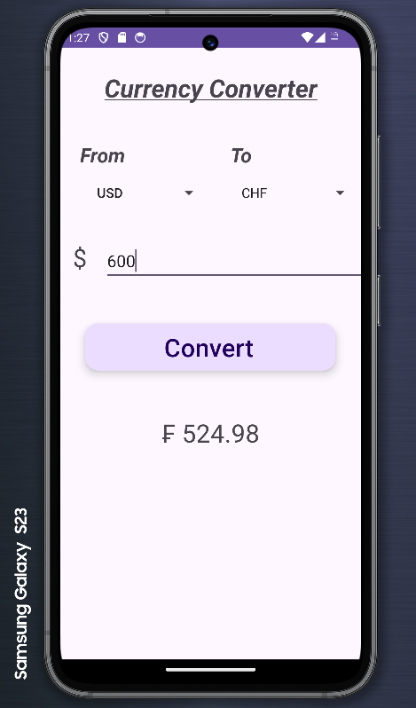

<b>Currency Converter App</b>

<ins><b>What was used to develop the application:</b></ins>
 <ul>
  <li>Kotlin</li>
  <li>XML</li>
  <li>OkHttp</li>
  <li>Exchange Rate Data API - (https://apilayer.com/marketplace/exchangerates_data-api)
 </li>
  <li>Android Studio</li>
</ul> 

  
<ins><b>What the app does</b></ins>
 This application allows the user to select a From/To currency type and convert to a desired currency 

<ins><b>Why this app was created</b></ins>
  This app was specifically made to showcase my skills when it comes to developing apps in <b>Kotlin</b> and using <b>REST APIs</b> 

 

<ins><b>Screenshots:</b></ins>
  
 

Additional Info:
This app will gradually be updated overtime

